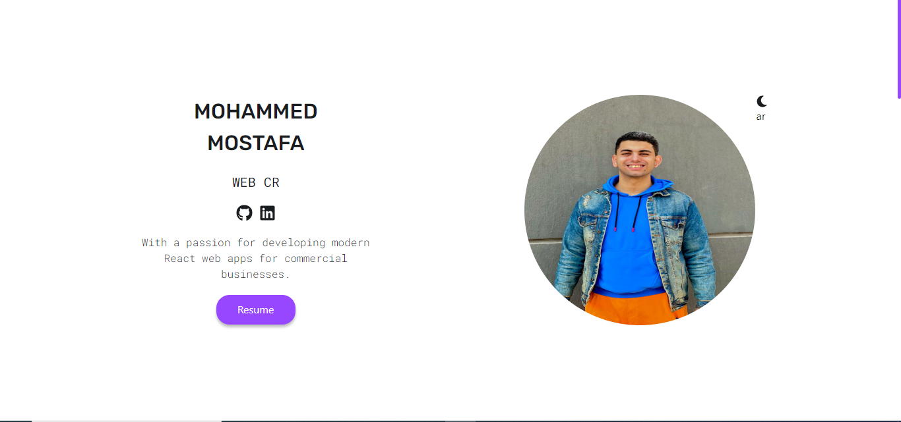

# Mohammed Mostafa Salem - Portfolio

Welcome to my personal portfolio website!  
I am a **Full Stack (MERN) Developer** showcasing my projects, skills, and experience.

---

## 🌐 Live Site
Check out the live website here:  
[https://mohammed-mostafa-salem.netlify.app/](https://mohammed-mostafa-salem.netlify.app/)

---

## 💻 About Me
Hi! I'm **Mohammed Mostafa Salem**, a passionate Full Stack Developer with experience in building web applications using **React.js, Next.js, Node.js, Express and MongoDB**.  
I enjoy creating projects that solve real-world problems and improve user experience.

---

## 🛠 Skills
- **Frontend:** HTML, CSS, JavaScript, React.js, Next.js, Redux, Tailwind CSS, Bootstrap  
- **Backend:** Node.js, Express.js, MongoDB, REST APIs  
- **Other Tools:** Git, GitHub, Socket.io, JWT, Material-Tailwind

---

## 📂 Projects
Here are some highlighted projects:

1. **Chato (In Progress)**  
   Real-time chat application with authentication and messaging system. Built using MERN stack and Socket.io.  

2. **ECOMMERCE (Completed)**  
   E-commerce web application with product listing, shopping cart, and product details pages. 

3. **Quran App (Completed)**  
   Web application for listening to Quran with surah selection, audio player and search functionality.

*(All projects are available on [GitHub](https://github.com/MuhammedMostafaSalem))*

---

## 📫 Contact
- WhatsApp: [Click to chat](https://wa.me/+201557934448)  
- LinkedIn: [Profile](https://www.linkedin.com/in/mohamed-mostafa-aa9184218/)  
- GitHub: [Repositories](https://github.com/MuhammedMostafaSalem)  

---

## ⚡ Note
This portfolio is currently **under continuous improvement** as I keep adding new projects and refining my skills.